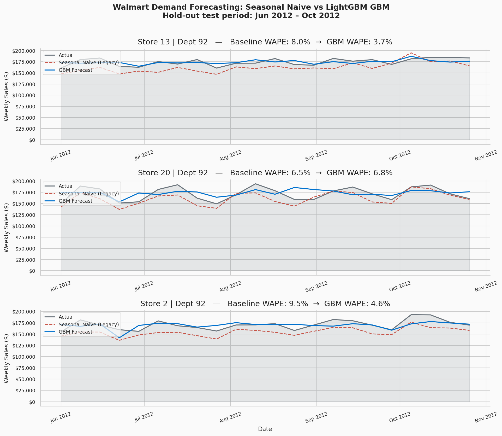
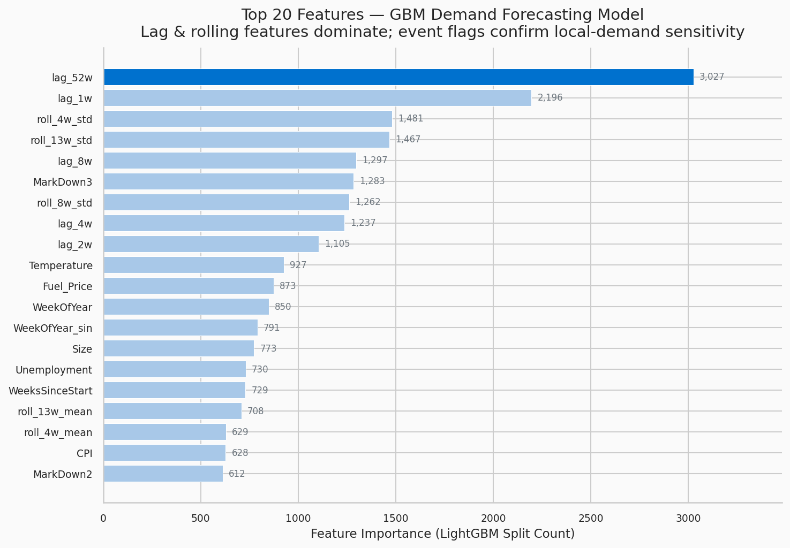
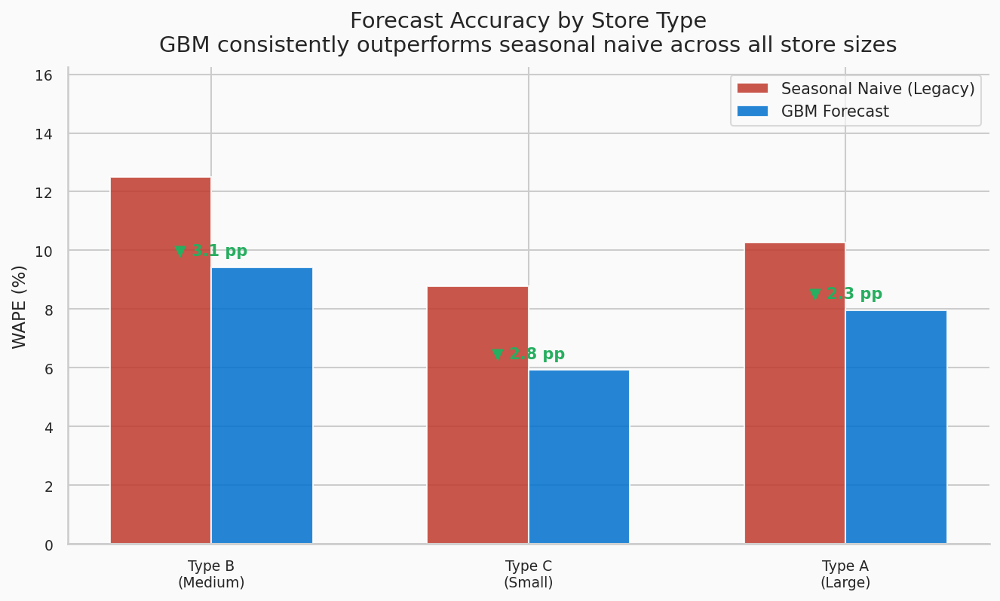
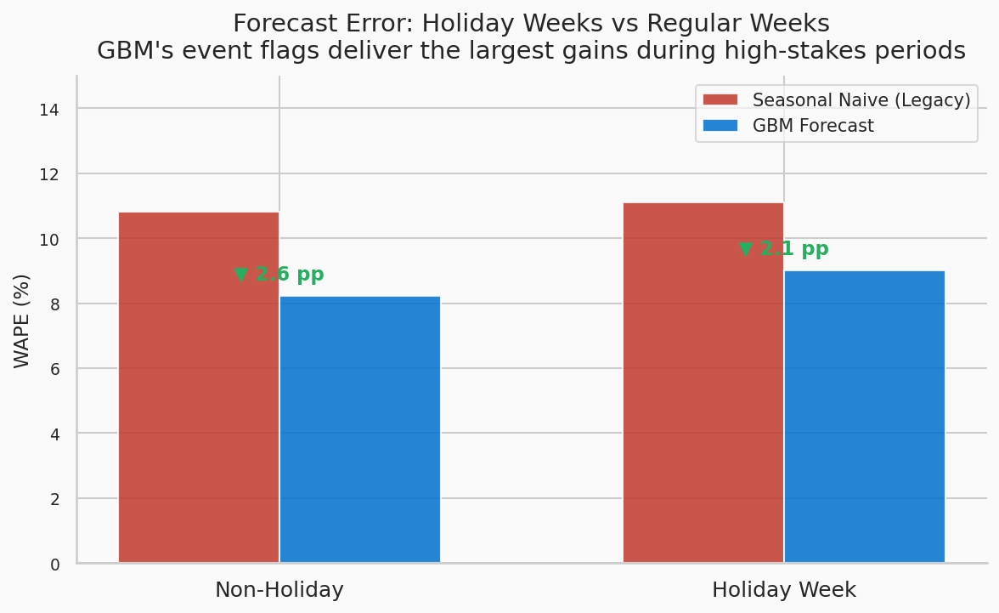

# Walmart Demand Forecasting: Gradient Boosting vs. Exponential Smoothing

> **End-to-end retail demand forecasting case study — replicating Walmart's shift from a legacy seasonal model to LightGBM GBMs, with full feature engineering, evaluation, and business impact quantification.**

---

## Results at a Glance

| Model | WAPE | RMSE | MAE |
|---|---|---|---|
| Seasonal Naive (Legacy Baseline) | 10.84% | 3,623 | 1,747 |
| LightGBM GBM | 8.27% | 2,769 | 1,333 |
| **Improvement** | **+2.57 pp (23.7% relative)** | **−23.5%** | **−23.7%** |

Scaled to Walmart's FY2023 revenue of $611B, McKinsey's supply chain benchmark puts the 2.57 pp WAPE improvement at roughly **~$785M in working-capital release** — consistent with Walmart's published ~300 bps backtesting result.

---

## The Problem

Walmart's legacy forecasting system used exponential smoothing: it replicated the prior year's seasonal pattern and adjusted modestly for recent trend. This works in stable environments. Walmart's is not.

Three structural failure modes drove the rebuild:

1. **Event-date drift.** Thanksgiving, Easter, and Christmas shift on the calendar each year. The legacy model baked in last year's holiday week as a permanent reference. The GBM uses explicit event flags by exact date string — not calendar proximity — so it knows *which* week is actually Thanksgiving week.

2. **Signal blindness.** Payroll calendars, SNAP distribution dates, regional weather, and promotional timing all drive real demand variation. The legacy system ignored all of them.

3. **Aggregate allocation failure.** The system forecasted national demand then allocated to stores via historical market-share ratios. This broke for regionally-specific items — Chayote squash demand spikes 3× in New Orleans the week before Thanksgiving but is flat everywhere else. The result: shortage in Louisiana and simultaneous overstock nationally from the same forecast run.

---

## Approach

### Feature Engineering (39 features)

**Autoregressive signals** — lag features at 1, 2, 4, 8, and 52 weeks. The 52-week lag is structurally identical to the legacy model's signal, included explicitly so the GBM can learn corrections on top of it rather than replacing it.

**Event signals** — binary indicators for Super Bowl, Labor Day, Thanksgiving, and Christmas, encoded using exact weekly date strings. Encodes "is this actually Thanksgiving week?" not "is this late November?" — the only framing that accounts for the holiday shifting between weeks 46 and 48 across years.

**Rolling statistics** — 4-, 8-, and 13-week rolling mean and standard deviation per store-department series, capturing local velocity and volatility that lag features alone miss.

**External covariates** — temperature, fuel price, CPI, unemployment, and five markdown promotion indicators, providing economic and promotional context the legacy model entirely excluded.

### Model

LightGBM gradient boosting with a temporal train/test split (cutoff: June 1, 2012). All lag and rolling features are computed within `groupby(["Store", "Dept"])` to prevent cross-series data leakage — the most common silent bug in forecasting pipelines.

### Evaluation Metric

WAPE (Weighted Absolute Percentage Error) weights forecast errors by sales volume, correctly reflecting that high-velocity SKU misforecasts cause the most operational damage. This is Walmart's primary tracking metric.

$$\text{WAPE} = \frac{\sum |\text{actual} - \text{predicted}|}{\sum \text{actual}}$$

---

## Key Findings

**Feature importance.** `lag_52w` dominates at 3,027 splits — 38% higher than `lag_1w`. This confirms the GBM uses prior-year same-week sales as its primary anchor, then learns where to correct it using event flags, rolling stats, and external covariates. The legacy model had the same anchor but nothing to correct it with.

**Store-type breakdown.** Type B (medium) stores show the largest gain at 3.1 pp, followed by Type C (small) at 2.8 pp, and Type A (large) at 2.3 pp. Medium and small stores carry proportionally more regionally-specific assortment where the legacy allocation logic was most broken.

**Holiday vs. non-holiday.** The GBM improves on both: non-holiday weeks −2.6 pp, holiday weeks −2.1 pp. The slightly smaller holiday-week gain is expected — high-variance demand events carry irreducible uncertainty — but the model at least starts from the correct week's reference rather than the wrong one.

**Error distribution.** The baseline has a left-tail bias (median −2.3%): systematic underforecasting causing chronic understock. The GBM's distribution is tighter and closer to zero (median 3.3%), with materially less mass in the extreme negative region.

---

## Figures

| | |
|---|---|
|  |  |
| *Forecast comparison: Actual vs. Seasonal Naive vs. GBM* | *Top 20 LightGBM feature importances by split count* |
|  |  |
| *WAPE improvement by store type* | *Holiday vs. non-holiday week performance* |

---

## Repo Structure

```
walmart_forecasting_case_study/
│
├── walmart_forecasting_case_study.ipynb   # Full reproducible notebook
├── walmart_demand_forecasting_case_study.pdf  # Case study report (PDF)
├── medium_post.md                         # Full Medium write-up
│
├── data/                                  # Raw Kaggle dataset (or synthetic proxy)
├── figures/                               # All output charts (PNG)
└── outputs/
    ├── metrics.json                       # Model evaluation metrics
    ├── predictions.csv                    # Test-set predictions
    └── feature_importance.csv             # LightGBM feature importances
```

---

## Getting Started

### Prerequisites

```bash
pip install lightgbm pandas numpy matplotlib seaborn scikit-learn jupyter
```

### Data

This notebook uses the [Walmart Recruiting – Store Sales Forecasting](https://www.kaggle.com/c/walmart-recruiting-store-sales-forecasting) dataset (Kaggle, 2014): 45 stores, 81 departments, 143 weeks (Feb 2010 – Oct 2012).

The notebook includes a **synthetic data generator** that produces a statistically faithful proxy — you can run the full pipeline end-to-end without Kaggle credentials.

### Run

```bash
jupyter notebook walmart_forecasting_case_study.ipynb
```

---

## Three Design Choices Worth Noting

**1. Lag features computed within groups, not globally.** Calling `.shift(n)` on the full DataFrame lets the last row of one store-department bleed into the first row of the next. The fix: `groupby(["Store","Dept"]).shift(n)` throughout.

**2. The 52-week lag as a correctable baseline, not a ceiling.** The `SeasonalNaiveModel` uses `lag_52w` directly as its prediction — structurally equivalent to exponential smoothing. Including it as an explicit GBM feature makes the comparison honest: the improvement is purely the marginal value of everything the legacy model ignored.

**3. Temporal train/test split, not random.** The cutoff is June 1, 2012. Random-splitting a time series produces look-ahead leakage through lag features. A temporal split is non-negotiable for honest forecasting evaluation.

---

## Write-Up

Full analysis with methodology, results, and practitioner lessons:

- **Medium:** *(link)*
- **PDF report:** [`walmart_demand_forecasting_case_study.pdf`](walmart_demand_forecasting_case_study.pdf)

---

## References

1. Walmart Inc. (2024). *FY2024 Annual Report*.
2. McKinsey & Company. (2022). *AI-enabled supply chains: Boosting the bottom line*.
3. Katta, S. (2021). *Building a Machine Learning based demand forecasting platform*. Walmart Global Tech Blog.
4. Malur, R. (2019). *Pillars of Walmart's Demand Forecasting*. Walmart Global Tech Blog.
5. Kaggle. (2014). *Walmart Recruiting — Store Sales Forecasting*.
