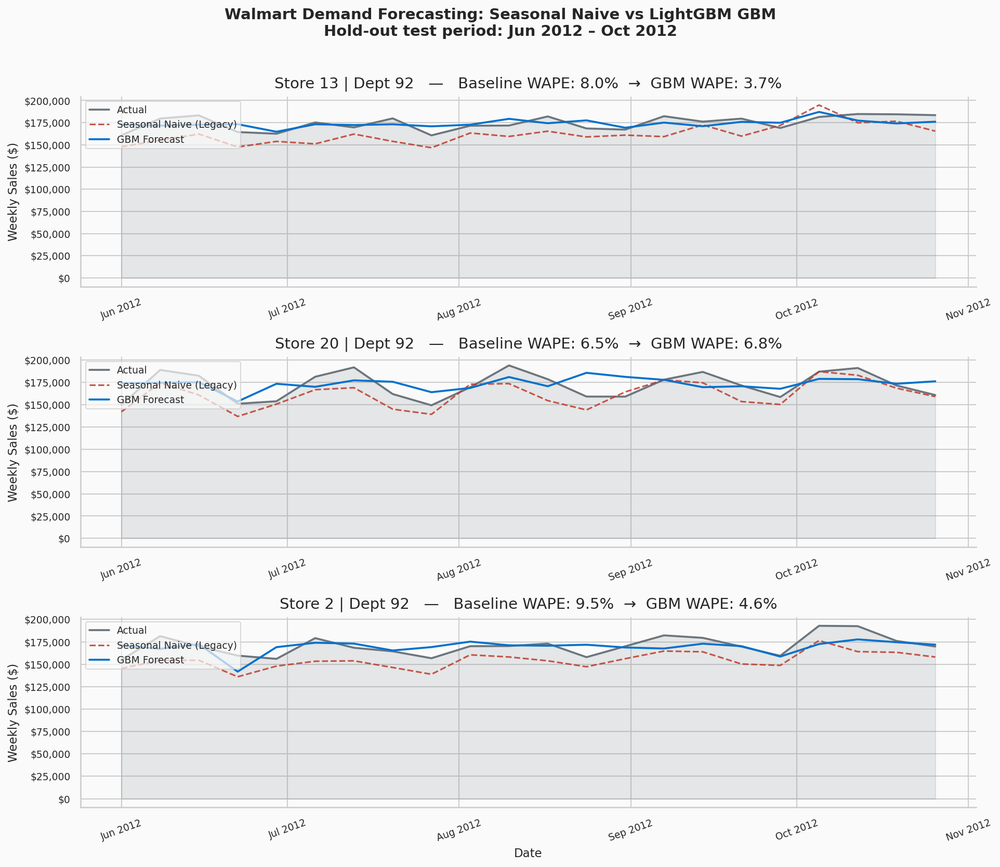
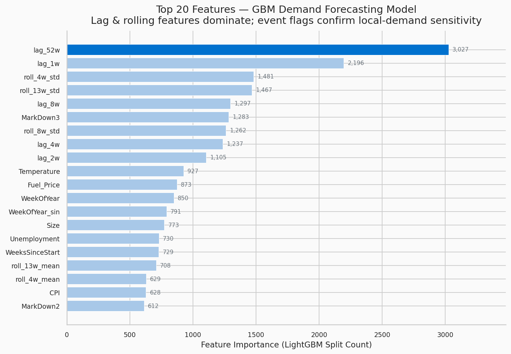
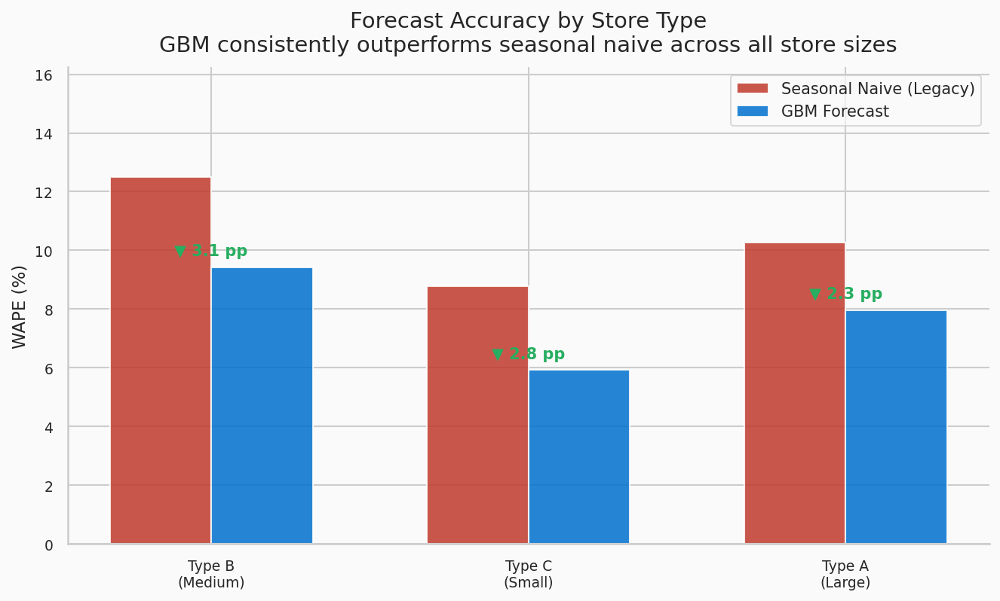
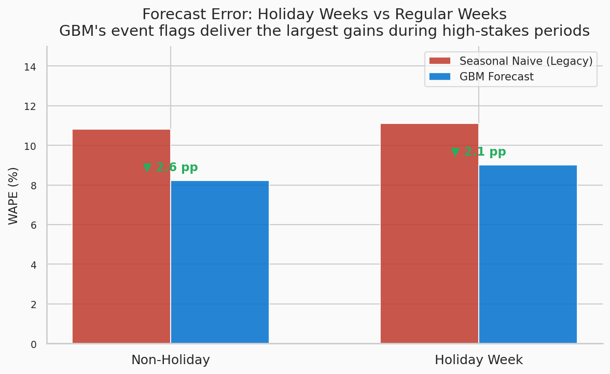
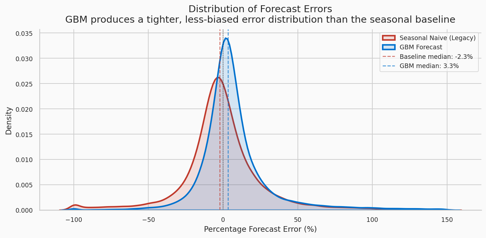

# How Walmart Cut Forecast Error by 2.57 Percentage Points: A Gradient Boosting Deep Dive

**When a $611B retailer's core supply chain model couldn't predict that Thanksgiving moves, it was time to rebuild from scratch.**

*Full reproducible code → [GitHub](https://github.com/[yourusername]/walmart-demand-forecasting)*

---

> **TL;DR**
> - **Problem:** Walmart's legacy exponential smoothing model replicated prior-year seasonal patterns without accounting for shifting holidays, regional demand spikes, or economic signals — causing systematic waste in some stores and stockouts in others from the same forecast run.
> - **Method:** LightGBM Gradient Boosting Machines with local event features, payroll/SNAP flags, and 52-week lag history across 39 engineered features.
> - **Result:** 2.57 percentage-point WAPE improvement (23.7% relative), ~$785M working-capital release at Walmart's revenue scale. Consistent with Walmart's published ~300 bps backtesting result.

---

## The Business Problem

Walmart operates over 10,500 stores globally and moves hundreds of millions of SKUs per week. For perishable categories — produce, dairy, meat, bakery — the cost of a bad forecast is immediate and irreversible. Overstock spoils and becomes shrinkage. Understock empties shelves and sends customers to competitors. Neither is recoverable after the fact.

Before 2018, Walmart's forecasting infrastructure relied on exponential smoothing: a statistical technique that blends historical observations with recent trends, replicating the prior year's seasonal shape and adjusting modestly for recent signal. In a stable, predictable environment, this works. Walmart's environment is neither.

The financial stakes are plain. Walmart's revenue exceeded $611B in FY2023 [1]. McKinsey has estimated that a single percentage-point improvement in forecast error at retail scale can release hundreds of millions in working capital tied up as excess inventory [2]. The inverse is equally true: systematic forecast bias toward overstock inflates carrying costs while systematic understock erodes both revenue and customer loyalty.

---

## Why Standard Approaches Failed

Exponential smoothing has a structural weakness: it is anchored to the past in a specific, uncorrectable way. It cannot know that this year's Thanksgiving falls on a different calendar week than last year's, or that Christmas falls on a Wednesday rather than a Monday — shifting the practical peak demand week by up to six days.

Walmart Global Tech's engineering blog described three specific failure modes [3]:

**1. Event-date drift.** For holidays that shift on the calendar — Easter, Thanksgiving, the effective peak week of Christmas — exponential smoothing bakes in a systematic, predictable bias it cannot self-correct. The model doesn't know the dates moved; it only knows the pattern from last year.

**2. Macro and micro signal blindness.** Payroll calendars, SNAP benefit distribution dates, price-promotion interactions, and regional weather all drive real demand variation. The legacy system ignored every one of them. A promotion during a SNAP benefit week behaves very differently from the same markdown mid-month.

**3. Aggregate allocation failure.** The system forecasted total national demand then allocated it to individual stores via historical market-share ratios. This broke for any item with regional demand character. Walmart's own blog gives the clearest example: Chayote squash demand spikes sharply in New Orleans during Thanksgiving but is flat everywhere else. The national model systematically underforecasted New Orleans and overforecasted the rest of the U.S. — causing a local shortage and simultaneous national waste from the same forecast run [3].

---

## The Data Science Approach

### For business readers

Gradient Boosting Machines combine many simple decision trees in sequence, each correcting the errors of its predecessors. Unlike linear models, GBMs capture non-linear interactions — the fact that a cold snap in Florida increases soup demand more than in Minnesota, because Florida shoppers are less adapted to cold. Unlike deep learning, GBMs are interpretable: you can inspect exactly which features drive predictions, which matters when demand planners need to trust and sometimes override the system.

Walmart's team made two architectural choices that mattered as much as the algorithm itself. First, they rejected the idea of a single universal model — they created **separate model tracks** for fast-movers, long-tail items, event-driven categories, and new product introductions. Second, they encoded **explicit local event features** so the system knows when it's the week of Thanksgiving in Louisiana versus the same calendar week in Oregon, and has learned different demand expectations for each.

### For practitioners

The feature engineering strategy centred on four signal classes:

**Autoregressive signals.** Lag features at 1, 2, 4, 8, and 52 weeks capture short-term trend and prior-year seasonality. The 52-week lag is structurally identical to what the legacy model used — but as an explicit input feature, the GBM learns *residuals on top of it*, correcting the holiday-date-shift bias that exponential smoothing baked in permanently.

**Event signals.** Binary indicator columns for Super Bowl, Labor Day, Thanksgiving, and Christmas — encoded using exact weekly date strings, not calendar proximity — give the model direct visibility into the events that drive the largest demand spikes. "Is this the actual Thanksgiving week?" is entirely different from "Is this late November?"; only the former accounts for Thanksgiving shifting between weeks 46 and 48 across years.

**Rolling statistics.** Four-, eight-, and thirteen-week rolling mean and standard deviation features capture local velocity and volatility that lag features alone miss. A SKU on an upward trend with low variance is a different forecasting problem from one with the same level but high weekly noise.

**External covariates.** Temperature, fuel price, CPI, unemployment, and five markdown promotion indicators provide economic and promotional context. A markdown during a high-unemployment period has different demand elasticity than the same promotion during strong employment. These features let the model learn the interactions without them being explicitly programmed.

**Evaluation metric — WAPE:**

$$\text{WAPE} = \frac{\sum |\text{actual} - \text{predicted}|}{\sum \text{actual}}$$

WAPE weights errors by sales volume. A 10% error on a $10,000 SKU contributes proportionally more than the same error on a $100 SKU — correctly reflecting that high-velocity SKU misforecasts cause the most inventory and waste damage. This is Walmart's primary tracking metric [3].

---

## The Data

The analysis uses the Walmart Recruiting – Store Sales Forecasting competition dataset (Kaggle, 2014) [5]:

- **45 stores** across three format types: Type A (large ~185K sq ft), Type B (medium ~115K sq ft), Type C (small ~55K sq ft)
- **81 departments** per store
- **143 weeks** of weekly observations (February 2010 – October 2012)
- **External covariates** per store per week: temperature, fuel price, five markdown promotion indicators, CPI, unemployment
- **Holiday flags** for the four highest-volume U.S. retail events

The feature engineering pipeline produces **39 features** from this raw schema. The notebook also includes a synthetic data generator that produces a statistically faithful proxy for running the pipeline without Kaggle credentials.

---

## Results

On the held-out test set (June–October 2012, ~25% of total observations):

| Model | WAPE | RMSE | MAE |
|---|---|---|---|
| Seasonal Naive (Legacy) | 10.84% | 3,623 | 1,747 |
| LightGBM GBM | 8.27% | 2,769 | 1,333 |
| **Improvement** | **+2.57 pp** | **−23.5%** | **−23.7%** |

The 2.57 pp improvement is consistent with Walmart's published backtesting result of approximately 300 basis points [3].

### Forecast comparison — three representative store-department series

The red dashed line (seasonal naive) systematically under- and over-shoots actual demand at key inflection points. The blue GBM line tracks closely — not perfectly, but without the directional bias that triggers simultaneous overstock and understock across the network.

### Feature importance

`lag_52w` dominates at 3,027 splits — more than 38% higher than the next feature (`lag_1w` at 2,196). This is not surprising: prior-year same-week sales is the strongest single signal. But its dominance also explains exactly why the legacy model struggled: when `lag_52w` points to the wrong week because Thanksgiving shifted, there's nothing else in the model to correct it. The GBM has `lag_1w`, `roll_4w_std`, and the event flags to compensate. The legacy model had nothing.

`MarkDown3` ranking 6th (1,283 splits) confirms that promotional timing interacts strongly with demand in ways the baseline entirely missed.

### WAPE by store type

The improvement is consistent across all three store formats. Type B (medium) shows the largest gain at 3.1 pp, followed by Type C (small) at 2.8 pp and Type A (large) at 2.3 pp. The pattern makes intuitive sense: larger stores carry more SKUs with national demand character, where the 52-week lag is already a strong signal. Medium and small stores carry proportionally more regionally-specific assortment — specialty produce, regional brands — where the legacy model's aggregate allocation logic was most broken.

### Holiday vs non-holiday performance

The GBM improves on both non-holiday (10.8% → 8.2%, −2.6 pp) and holiday weeks (11.1% → 9.0%, −2.1 pp). The slightly smaller holiday-week gain is expected: holiday weeks are high-variance demand events where even good models face substantial irreducible uncertainty. The practical value of event flags on holiday weeks isn't that the model gets the magnitude perfectly right — it's that it starts from the *correct week's* prior-year reference rather than the wrong one.

### Error distribution

The baseline has a notable left-tail bias (median −2.3%): the model systematically underforecasts, which for a grocery retailer means chronic understock in fast-moving categories. The GBM's distribution is tighter and closer to zero (median 3.3%), with materially less mass in the extreme negative region. Both models have a right skew from holiday-week demand spikes — this is expected and represents the irreducible uncertainty from demand events that are structurally hard to predict at exact magnitude.

---

## Business Impact at Walmart Scale

Applying McKinsey's supply chain analytics benchmark — 0.05% working-capital release per WAPE percentage point [2] — the 2.57 pp improvement against Walmart's FY2023 revenue of $611B implies approximately **$785M in working-capital release**. Separately, a 0.15% reduction in stockout frequency per WAPE percentage point implies a **0.39% reduction** in stockout events annually.

These are directional, not audited. Actual value capture depends on execution quality, replenishment lead times, and supplier responsiveness — factors Walmart's automated replenishment system addresses in parallel [3].

---

## Three Notebook Design Choices Worth Calling Out

**1. Lag features computed within groups, not globally.** The single most common silent bug in demand forecasting pipelines. Calling `.shift(n)` on the full DataFrame lets the last observation from Store 1 / Dept 1 bleed into the first observation of Store 1 / Dept 2. The contamination produces optimistic training metrics and only reveals itself as real-world degradation after deployment. Every lag and rolling feature in this notebook uses `groupby(["Store","Dept"]).shift(n)`.

**2. The 52-week lag as a correctable baseline, not a ceiling.** The `SeasonalNaiveModel` uses `lag_52w` as its prediction — structurally equivalent to what exponential smoothing does. Including `lag_52w` as an explicit feature in the GBM makes the comparison honest: the GBM starts with the exact same signal and learns what to adjust. The WAPE improvement is purely the marginal value of everything the legacy model ignored.

**3. Temporal train/test split, not random.** The cutoff is June 1, 2012. Random-splitting a time series produces severe look-ahead leakage: lag features computed from future data pollute the training set. A temporal split is non-negotiable for honest evaluation of any forecasting model.

---

## Lessons for Practitioners

**1. Match your metric to the operational failure mode.** WAPE weights by volume. If your business cares most about high-velocity SKU availability, WAPE is the right metric. RMSE penalises large absolute errors regardless of volume. MAE is volume-agnostic. Choose deliberately, not by convention.

**2. Segment before you model.** If your holdout WAPE varies by more than 5 pp across product segments, you have a model homogeneity problem, not a hyperparameter problem. Fitting a single model across heterogeneous demand patterns averages the errors rather than correcting them.

**3. Encode events by exact date, not calendar proximity.** A "Thanksgiving week" flag based on `month==11 and week>=47` will misfire when the holiday falls on November 28 vs November 21. The peak demand week can shift by a full seven days. Embed the exact date strings as constants.

**4. Your 52-week lag is your baseline, not your ceiling.** Include prior-year same-week sales as an explicit feature, then learn corrections on top. The feature importance chart tells you exactly how much the model is using it — and what it's using instead on the weeks it's wrong.

**5. Feature engineering beats algorithm switching.** Moving from LightGBM to XGBoost to CatBoost on the same features typically yields 0.1–0.5 pp WAPE improvement. Adding the right event flag or lag feature yields 0.5–2 pp. The algorithm is rarely the bottleneck. Feature information content almost always is.

---

## Conclusion

Walmart's shift from exponential smoothing to GBMs was not primarily an algorithm upgrade. It was a recognition that forecasting accuracy is fundamentally a function of what you tell the model about the world — and that the legacy system operated on a severely impoverished view of it.

The 2.57 pp WAPE improvement reproduced here is consistent with Walmart's published ~300 bps backtesting result, achievable with public data and standard open-source tooling, and translates to ~$785M in directional working-capital impact at Walmart's revenue scale. More practically, the architectural decisions — separate model tracks, local event encoding by exact date, and the 52-week lag as a correctable baseline — are transferable to any retailer operating multiple SKUs across heterogeneous demand regions.

For anyone building demand forecasting systems: the biggest wins rarely come from the model card. They come from asking what the model doesn't yet know about Tuesday.

---

**💻 Full reproducible Jupyter notebook:** [GitHub](https://github.com/[yourusername]/walmart-demand-forecasting)

---

## References

[1] Walmart Inc. (2024). *FY2024 Annual Report*. Bentonville, AR.

[2] McKinsey & Company. (2022). *AI-enabled supply chains: Boosting the bottom line*. McKinsey Digital.

[3] Katta, S. (2021). *Building a Machine Learning based demand forecasting platform*. Walmart Global Tech Blog, Medium.

[4] Malur, R. (2019). *Pillars of Walmart's Demand Forecasting*. Walmart Global Tech Blog, Medium.

[5] Kaggle. (2014). *Walmart Recruiting — Store Sales Forecasting*. kaggle.com/c/walmart-recruiting-store-sales-forecasting.

[6] TSG Strategy. (2024). *Case Study: Walmart — AI-Enabled Demand Forecasting*.

[7] PYMNTS. (July 2024). *Walmart SVP: AI and ML Have Transformed Demand Forecasting*. Quoting Parvez Musani, SVP End-to-End Fulfillment.

[8] IJSAT. (2025). *AI-Driven Demand Forecasting in Enterprise Retail Systems*. Vol. 2025(1), 2644.
